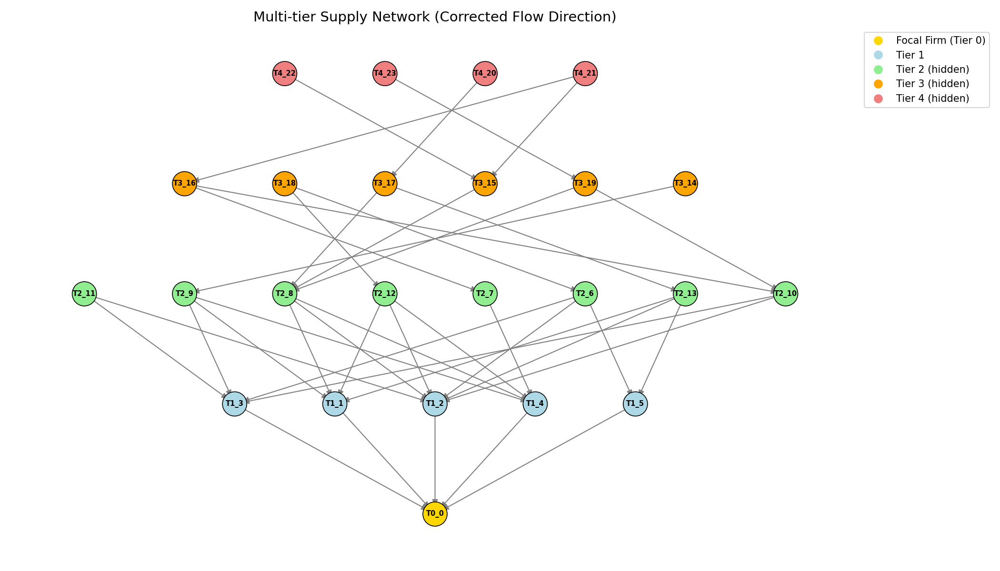
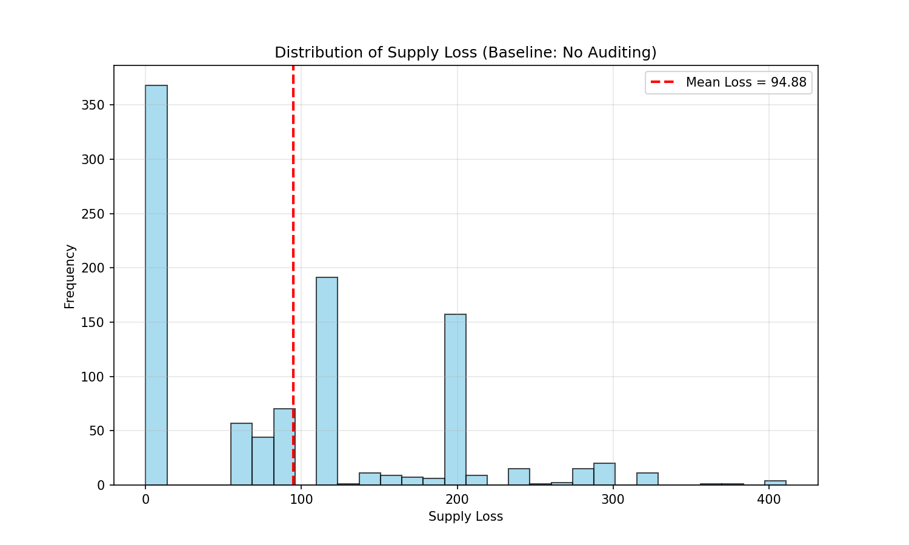
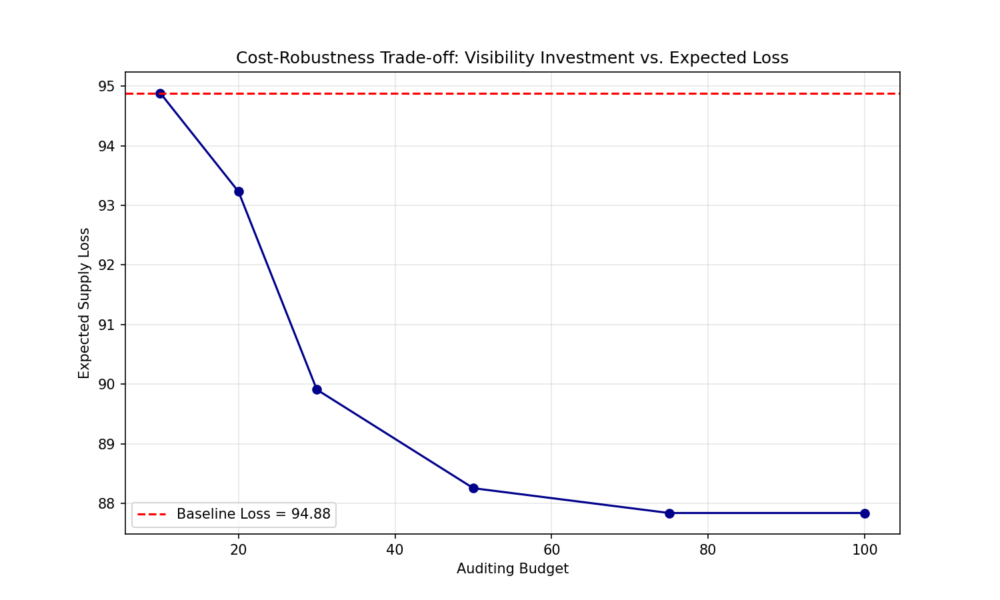
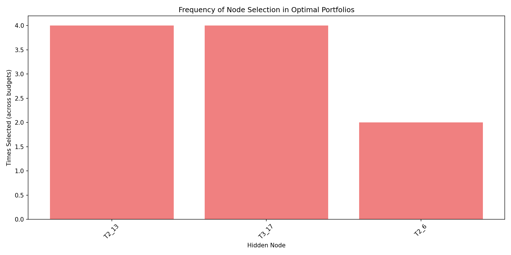

# Multi-Tier Supply Network Visibility Optimization: Trading Off Cost and Robustness

[](https://www.python.org/)
[](https://networkx.org/)
[]()
[](https://pypi.org/project/PuLP/)
[](https://opensource.org/licenses/MIT)
[]()
[]()

> A computational experiment exploring how a focal firm can optimally invest in visibility across deep supply tiers to improve resilience under disruption uncertainty.



---

## 📖 Overview

This repository contains a **miniature research project** developed to investigate a practical problem in supply chain management: **Which hidden suppliers should a firm audit when it has limited budget, in order to minimize the expected impact of disruptions?**  

The work is directly motivated by the PhD position on **supply chain visibility and resilience** at KU Leuven (Faculty of Economics and Business), and it demonstrates the application of network theory, Monte Carlo simulation, and combinatorial optimization to tackle this question.

---

## 🎯 Motivation

Modern supply chains often span 10+ tiers, yet firms typically have visibility only into their immediate (tier-1) suppliers. This lack of transparency makes it difficult to anticipate, prepare for, or respond to disruptions originating deep in the upstream network.  

This project addresses the core question: **Given a limited budget, where should a firm invest in visibility to maximize supply chain robustness?**  
The answer reveals that *not all visibility is created equal* — a few strategic audits yield the bulk of achievable gains, after which additional investment brings diminishing returns.

---

## 🧩 Problem Statement

A focal firm operates in a multi-tier supply network represented as a **directed acyclic graph**.  
- **Nodes** represent suppliers across tiers 1–4 (each with capacity, failure probability, audit cost).  
- The firm can **audit** a hidden node (tier ≥ 2) by paying its audit cost, which *halves* its failure probability.  
- **Objective:** Select a subset of hidden nodes (subject to budget) that **minimizes the expected supply loss** at the focal firm.

The problem is decomposed into:
1. **Estimation** of the *reduction in expected loss* (benefit) if each hidden node were audited, via Monte Carlo simulation.
2. **Optimization** using a Binary Knapsack model that maximizes total benefit under budget constraints.

---

## ⚙️ Methodology

### 🕸️ 1. Synthetic Multi-Tier Supply Network
- Built with `NetworkX`.
- 5 tiers (Tier 0 = focal firm; Tier 1–4 = suppliers).
- Edges follow material flow direction: **deeper-tier suppliers → shallow-tier customers**.
- Nodes hold attributes: `capacity`, `failure_prob`, `audit_cost`.

### 📉 2. Baseline Risk Simulation
- 1,000 Monte Carlo runs.
- Failures are sampled independently based on `failure_prob`.
- Supply propagation logic: a node can deliver up to its capacity, limited by the inflow from its own suppliers.
- Results: **Baseline Expected Supply Loss** and loss distribution (no audits).

### 🧮 3. Optimization Model
- For each hidden node, a separate simulation (500 runs) is performed with only that node’s failure probability halved → **benefit** = drop in expected loss.
- A **binary integer linear program (Knapsack)** is solved with `PuLP` (CBC) for various budgets.
- The output: optimal set of nodes to audit, total cost, and resulting expected loss.

---

## 📊 Results & Insights

### 1. Supply Loss Distribution (Baseline)


- **Average loss: 94.88 units**  
- High variance; losses can spike up to **411 units** — a clear sign of hidden vulnerability.

### 2. Cost–Robustness Trade-off


- With a modest budget, expected loss drops noticeably.
- **The curve flattens** beyond a budget of ~75, indicating that no further nodes with positive net benefit exist — **additional spending does not improve resilience**.

### 3. Critical Node Identification


- Only two nodes (**T3_17** and **T2_13**) appear in nearly all optimal portfolios.
- These are high-capacity suppliers positioned at structural bottlenecks.
- Many other nodes show *negative estimated benefit*, meaning auditing them would not reduce expected loss.

### 💡 Key Takeaways
- **Targeted visibility is highly cost-effective.**  
- **Budget saturation occurs** — managers must recognize when to stop investing in audits.
- The experiment demonstrates how **network structure, uncertainty, and optimization** can jointly inform resilience strategies.

---

## 🧪 Relevance to the PhD Position

This miniature project directly mirrors the three aims of the KU Leuven PhD project on **supply chain visibility and resilience**:

| PhD Aim | How this project aligns |
|--------|--------------------------|
| **Aim 1:** Characterize how network structure affects cost & robustness of visibility | We show that the benefit of auditing a node depends on its topological position, capacity, and failure probability. |
| **Aim 2:** Study actions a focal firm can take within its local sphere of influence | We explicitly model a sourcing/auditing strategy under budget constraints. |
| **Aim 3:** Validate theoretical framework empirically | The framework is designed to be extended with real-world supply network data. |

---

## 🚀 How to Run

### Step 1 – Clone the repository

Open a terminal (Command Prompt, PowerShell, Terminal) and run:

```bash
git clone https://github.com/Shah-Ghasemi/multi-tier-visibility-resilience-tradeoff.git
 ```
Then navigate into the project folder:
```bash
cd multi-tier-visibility-resilience-tradeoff
```
### Step 2 – Install dependencies

Make sure Python 3.8+ is installed, then execute:
```bash
pip install -r requirements.txt
```
### Step 3 – Execute the scripts (in order)

Run the three Python scripts from the terminal:
```bash
python network_generator.py
python simulation_baseline.py
python optimization_model.py
```
All generated figures (.png) and result files (.pkl) will appear inside the same folder.

## 📂 Repository Structure

├── network_generator.py            # Generate synthetic multi-tier supply network  
├── simulation_baseline.py          # Monte Carlo simulation for baseline risk  
├── optimization_model.py           # Benefit estimation + Knapsack optimization  
├── supply_network.png              # Visualisation of the generated network  
├── baseline_loss_distribution.png  # Distribution of supply losses (no audits)  
├── cost_robustness_tradeoff.png    # Budget vs. expected loss trade-off  
├── node_selection_frequency.png    # How often each node is selected  
├── requirements.txt                # Required Python packages  
└── README.md                       # This file  


📝 Author  
Shahrokh Ghasemi Dehcheshmeh

Email: shahrokh.gsmi@gmail.com

Developed as a preparatory exercise for the 2026 PhD application on supply chain visibility and resilience at KU Leuven.

📄 License  
This project is licensed under the MIT License – see the LICENSE file for details.
